# Report for Assignment 1

## Sanic


Name: Group 102

URL: https://github.com/janaabuasbeh/sanic102 

Number of lines of code and the tool used to count it: 

The tool that we used is Lizard which was obtained from the gitbook. The tool “pip install lizard” was used to download Lizard and then “python lizard.py” was executed. The number of lines of code is 50156 nLOC which can be represented as 50.156 KLOC.


Programming language: Python 


## Coverage measurement

### Existing tool

The existing tool that was used for the coverage measurement is Coverage.py which was provided in the gitbook. To execute the tool, we implemented “pip install coverage”. Based on that we either used the command “python -m coverage run -m pytest” for windows and “coverage run -m pytest” for mac which ran the coverage. We also added the modules required to run it such as “pip install sanic” and other required modules. Based on that, “python -m coverage report” was used to generate the report and it was exported as an html via “python -m coverage html”.


### Your own coverage tool


Group member name :  Amirreza Darabi

Function 1 name :    def refresh(self,passthru: Optional[Dict[str, Any]] = None,) -> Sanic:


Function Coverage Before Instrumentation: 


Overview of uncovered lines:


Function Instrumentation:


Function Coverage after instrumentation:


### Individual tests


coverage after tests:


## Coverage improvement:

The coverage increased  26%, from 71% to 97% after the instrumentation and enhancing the tests in the test file.


Elaboration:
In the overview of uncovered lines it can be seen that three if statements are not covered, the reason was that their condition was never true. In the improved test functions, these functions :
 “if self is not registered:”
“if not registered.state.server_info:” 
“if hasattr(self, "multiplexer"):” 
 are sets to be true, hence the coverage percentage is increased to 97%. 


Function 2 name :    def purge_tasks(self) -> None:

Function Coverage before instrumentation:


Overview of Uncovered Lines:


Function after Instrumentation:


Function Coverage after instrumentation:


### Individual tests


coverage after tests:


## Coverage improvement:

The coverage increased  21%, from 79% to 100% after the instrumentation and enhancing the tests in the test file.

Elaboration:
As it can be seen in the uncovered lines, the first if condition is never true and the second if condition is always true, the enhanced tests are designed in the way that all possible ways are covered and both of the following conditions are set to true and false:

“if task is None:”
“if task.done() or task.cancelled():” 


### Overall

<Provide a screenshot of the old coverage results by running an existing tool (the same as you already showed above)>


<Provide a screenshot of the new coverage results by running the existing tool using all test modifications made by the group>


## Statement of individual contributions

Amir: 

Ayush: I did smth

Jana:

Medon


## Own coverage tool
### Medon Abraham

**Function 1:** *def ack(self) -> None:*

The first function I choose to further analyze and improve is the def ack(self) -> None function in app.py.
The ack function in the provided code is designed to send an acknowledgment (ack) message to a Server Manager, indicating that a process is operational and ready to begin its work.

The dictionary ack_branch_coverage is used to instrument the function and track which branch of the if-else statement was executed. The result output by the instrumentation shows that *ack_has_multiplexer* branch is not hit.

*Intrumented code*

```
ack_branch_coverage = {
    "ack_has_multiplexer" : False,
    "ack_no_multiplexer" : False}
    

def ack(self) -> None:
        if hasattr(self, "multiplexer"):
            ack_branch_coverage["ack_has_multiplexer"] = True
            self.multiplexer.ack()
        else:
            ack_branch_coverage["ack_no_multiplexer"] = True
    def print_ack_coverage():
        for branch, hit in ack_branch_coverage.items():
            print(f"{branch} was {'hit' if hit else 'not hit'}")
```


*Result Output by Instrumentation*

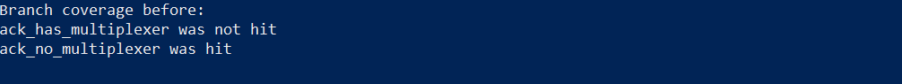

**Function 2:** *def _poll_monitor(self) -> Optional[MonitorCycle]*

The second funtion I choose to analyze and improve is def _poll_monitor(self) -> Optional[MonitorCycle] in manager.py.

The _poll_monitor function polls for messages from a monitor_subscriber with a timeout of 0.1 seconds, processes each message based on its content, and determines the appropriate action. If a message is received, it logs the message and checks if it is empty, a termination signal (__TERMINATE__), a tuple with 7 or 8 elements, or an invalid type. Based on these checks, it either handles the termination, manages the tuple, logs an error for invalid messages, or processes other messages appropriately, returning either MonitorCycle.BREAK or MonitorCycle.CONTINUE.


The monitor_branch_coverage is a dictionary initialized with keys representing different branches within the _poll_monitor function. Initially, all values are set to False. The result output by the instrumentation shows that *terminate_message*, *tuple_message*, *invalid_messsage*, and *no_message* branches were not hit. 


*Intrumented code*

```

monitor_branch_coverage = {
        "polled_message": False,
        "empty_message": False,
        "terminate_message": False,
        "tuple_message": False,
        "invalid_message": False,
        "default_message": False,
        "no_message": False,
    }

    def _poll_monitor(self) -> Optional[MonitorCycle]:
        if self.monitor_subscriber.poll(0.1):
            monitor_branch_coverage["polled_message"] = True
            message = self.monitor_subscriber.recv()
            logger.debug(f"Monitor message: {message}", extra={"verbosity": 2})
            if not message:
                monitor_branch_coverage["empty_message"] = True
                return MonitorCycle.BREAK
            elif message == "__TERMINATE__":
                monitor_branch_coverage["terminate_message"] = True
                self._handle_terminate()
                return MonitorCycle.BREAK
            elif isinstance(message, tuple) and (
                len(message) == 7 or len(message) == 8
            ):
                monitor_branch_coverage["tuple_message"] = True
                self._handle_manage(*message)  # type: ignore
                return MonitorCycle.CONTINUE
            elif not isinstance(message, str):
                monitor_branch_coverage["invalid_message"] = True
                error_logger.error(
                    "Monitor received an invalid message: %s", message
                )
                return MonitorCycle.CONTINUE
            monitor_branch_coverage["default_message"] = True
            return self._handle_message(message)
    
        monitor_branch_coverage["no_message"] = True
        return None

    def print_monitor_coverage(self):
        for branch, hit in monitor_branch_coverage.items():
            print(f"{branch} was {'hit' if hit else 'not hit'}")
```

*Result Output by Instrumentation*

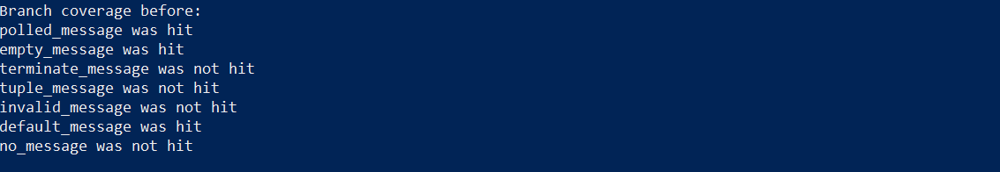

### Jana Salah Mohammad Ali Abuasbeh

**Function 1:** *def unregister_app(cls, app: Sanic) -> None:*

The first function I chose to improve the coverage of is the unregister_app(cls,app) function in app.py. This function unregisters a “Sanic” instance from the class registry. 

The dictionary unregister_branches is used to instrument the function and track which of the two if branches was executed. The result output by the instrumentation shows that *ack_has_multiplexer* branch is not hit.

*Intrumented code*

```
unregister_branches = {"not_an_instance": False, "name_in_registry": False}
    
@classmethod
def unregister_app(cls, app: Sanic) -> None:
if not isinstance(app, cls):
        		unregister_branches["not_an_instance"] = True
        		raise SanicException("Registered app must be an instance of Sanic")

    	name = app.name
    	if name in cls._app_registry:
        		unregister_branches["name_in_registry"] = True
        		del cls._app_registry[name]
    
def print_unregister_coverage():
    	hits = 0
    	for branch, hit in unregister_branches.items():
        		if hit:
            		print(f"{branch} was hit")
            		hits += 1
        		else:
           			print(f"{branch} was not hit")
   
   	coverage_percentage = (hits / len(unregister_branches)) * 100
    	print(f"\nCoverage: {hits}/{len(unregister_branches)} branches 
hit({coverage_percentage:.2f}%)")
	
```


*Result Output by Instrumentation*

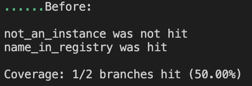

**Function 2:** *async def validate_file(request_headers: Header, last_modified: Union[datetime, float, int]) -> Optional[HTTPResponse]:*

The second function I chose to improve the coverage of is async def validate_file(request_headers, last_modified) -> Optional[HTTPResponse] in sanic/response/convenience.py. 

The validate_file function validates a file based on request headers. It takes the arguments request_headers (Header): the request headers, and last_modified (Union[datetime, float, int]): the last modified date and time of the file. It then returns an Optional[HTTPResponse] which is a response object with status 304 if the file is not modified.

*Intrumented code*

```

validate_branches = {
	"key_error": False,  # on If-Modified-Since
	"type_or_value_error": False,  # on If-Modified-Since
	"non_datetime": False,  # regarding last_modified
	"last_modified_none": False,  # timezone mismatch, last_modified None
	"if_modified_since_none": False,  # timezone mismatch, if_modified_since None
	"last_modified_smaller": False,  # last_modified <= if_modified_since
	"file_modified": False   # no specific response
}

async def validate_file(
	request_headers: Header, last_modified: Union[datetime, float, int]
) -> Optional[HTTPResponse]:
	try:
    		if_modified_since = request_headers.getone("If-Modified-Since")
	except KeyError:
    		validate_branches["key_error"] = True
    		return None
	try:
    		if_modified_since = parsedate_to_datetime(if_modified_since)
	except (TypeError, ValueError):
    		validate_branches["type_or_value_error"] = True
    		logger.warning("Ignorning invalid If-Modified-Since header received: " "'%s'",if_modified_since,)
    		return None

	if not isinstance(last_modified, datetime):
    		validate_branches["non_datetime"] = True
    		last_modified = datetime.fromtimestamp( 
float(last_modified),tz=timezone.utc).replace(microsecond=0)

	if (last_modified.utcoffset() is None and if_modified_since.utcoffset() is not None):
    		validate_branches["last_modified_none"] = True
    		logger.warning("Cannot compare tz-aware and tz-naive datetimes. To avoid "this 
conflict Sanic is converting last_modified to UTC.")
    		last_modified.replace(tzinfo=timezone.utc)
	elif (last_modified.utcoffset() is not None and if_modified_since.utcoffset() is None):
    		validate_branches["if_modified_since_none"] = True
    		logger.warning("Cannot compare tz-aware and tz-naive datetimes. To avoid ""this 
conflict Sanic is converting if_modified_since to UTC.")
    		if_modified_since.replace(tzinfo=timezone.utc)

	if last_modified.timestamp() <= if_modified_since.timestamp():
    		validate_branches["last_modified_smaller"] = True
    		return HTTPResponse(status=304)

	validate_branches["file_modified"] = True
	return None

def print_validate_coverage(app):
	hits = 0
	for branch, hit in validate_branches.items():
    		if hit:
        			print(f"{branch} was hit")
        			hits += 1
    		else:
        			print(f"{branch} was not hit")
    
	coverage_percentage = (hits / len(validate_branches)) * 100
	print(f"\nCoverage: {hits}/{len(validate_branches)} branches hit ({coverage_percentage:.2f}%)")


```


*Result Output by Instrumentation*

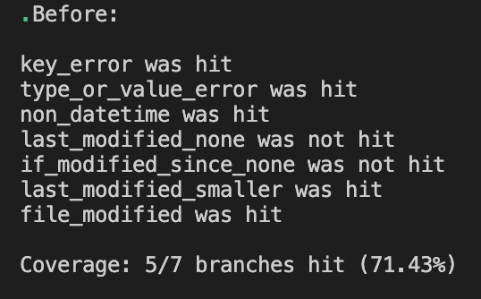

### Amirreza Darabi

**Function 1:** *def refresh(self,passthru: Optional[Dict[str, Any]] = None,) -> Sanic:*

The first function I choose to further analyze and improve is the def refresh(self,passthru: Optional[Dict[str, Any]] = None,) -> Sanic function in app.py.
The refresh function in the provided code is designed to refresh the application instance

The dictionary refresh_branch_coverage is used to instrument the function and track which branch of the if-else statement was executed. The result output by the instrumentation shows that first, second and fifth branch were not hit.

*Intrumented code*

```
refresh_branch_coverage = {"refresh_b1" : False, "refresh_b2" : False, "refresh_b3" : False, "refresh_b4" : False, "refresh_b5" : False}
    def refresh(
        self,
        passthru: Optional[Dict[str, Any]] = None,
    ) -> Sanic:
        registered = self.__class__.get_app(self.name)
        if self is not registered:
            refresh_branch_coverage["refresh_b1"] = True
            if not registered.state.server_info:
                refresh_branch_coverage["refresh_b2"] = True
                registered.state.server_info = self.state.server_info
            self = registered
        if passthru:
            refresh_branch_coverage["refresh_b3"] = True
            for attr, info in passthru.items():
                if isinstance(info, dict):
                    refresh_branch_coverage["refresh_b4"] = True
                    for key, value in info.items():
                        setattr(getattr(self, attr), key, value)
                else:
                    setattr(self, attr, info)
        if hasattr(self, "multiplexer"):
            refresh_branch_coverage["refresh_b5"] = True
            self.shared_ctx.lock()
        return self

    def print_refresh_coverage():
        for branch, hit in refresh_branch_coverage.items():
            print(f"{branch} was {'hit' if hit else 'not hit'}")
```


*Result Output by Instrumentation*


**Function 2:** *def purge_tasks(self) -> None:*

The second funtion I choose to analyze and improve is def purge_tasks(self) -> None: in app.py.

The function iterates through the task registry, identifying any tasks that are either done or cancelled, and then removes those tasks, leaving only the pending tasks in the registry.


The purge_branch_coverage is a dictionary initialized with keys representing different branches within the purge_tasks function. Initially, all values are set to False. The result output by the instrumentation shows that first and second branches were not hit.

*Intrumented code*

```

purge_branch_coverage = {"purge_b1" : False, "purge_b2" : False}


    def refresh(
        self,
        passthru: Optional[Dict[str, Any]] = None,
    ) -> Sanic:
        registered = self.__class__.get_app(self.name)
        if self is not registered:
            refresh_branch_coverage["refresh_b1"] = True
            if not registered.state.server_info:
                refresh_branch_coverage["refresh_b2"] = True
                registered.state.server_info = self.state.server_info
            self = registered
        if passthru:
            refresh_branch_coverage["refresh_b3"] = True
            for attr, info in passthru.items():
                if isinstance(info, dict):
                    refresh_branch_coverage["refresh_b4"] = True
                    for key, value in info.items():
                        setattr(getattr(self, attr), key, value)
                else:
                    setattr(self, attr, info)
        if hasattr(self, "multiplexer"):
            refresh_branch_coverage["refresh_b5"] = True
            self.shared_ctx.lock()
        return self

    def print_refresh_coverage():
        for branch, hit in refresh_branch_coverage.items():
            print(f"{branch} was {'hit' if hit else 'not hit'}")
```

*Result Output by Instrumentation*


### Ayush Khadka

Function 1: *def _extract_style(maybe_style: Optional[str], name: str) -> str:*

The function that was chosen to improve the coverage is the function _extract_style(maybe_style: Optional[str], name: str) -> str: in the css.py file. The purpose of this function is to retrieve contents from a css file. There are two ways of getting the content which are from the maybe_style which is an optional string representing a file path and from a default location. 

The dictionary extract_style_branch is used to instrument the function and track which branch of the statements was executed. The result outputted by the instrumentation show that the branches maybe_style_provided, maybe_path_exists, return_maybe_style and no_maybe_path branches are not hit. 

*Instrumented Code*

```
extract_style_branch = {
    "maybe_style_provided": False,  
    "maybe_path_exists": False,
    "return_maybe_style": False,
    "maybe_style_not_provided": False,
    "maybe_path": False,
    "no_maybe_path": False,
}

def _extract_style(maybe_style: Optional[str], name: str) -> str:
    if maybe_style is not None:
        extract_style_branch["maybe_style_provided"] = True
        maybe_path = Path(maybe_style)
        if maybe_path.exists():
            extract_style_branch["maybe_path_exists"] = True
            return maybe_path.read_text(encoding="UTF-8")
        extract_style_branch["return_maybe_style"] = True
        return maybe_style
    extract_style_branch["maybe_style_not_provided"] = True
    maybe_path = CURRENT_DIR / "styles" / f"{name}.css"
    if maybe_path.exists():
        extract_style_branch["maybe_path"] = True
        return maybe_path.read_text(encoding="UTF-8")
    extract_style_branch["no_maybe_path"] = True
    return ""

def print_extract_style_coverage():
    for branch, hit in extract_style_branch.items():
        print(f"{branch} was {'hit' if hit else 'not hit'}")

```
*Result Output by Instrumentation*

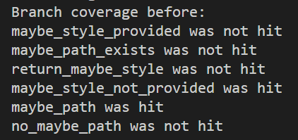

Function 2: *def __eq__(self, other):*

The function that was chosen to improve the coverage is the function *def __eq__(self, other):* in the headers.py file. The purpose of this function is to compare and to see if they repesent the same MIME type for (self) and (other). It checks for a string or MediaTypes. For the string comparison, if there are paramaters such as ; then it will raise an error due to the rule comparision. It compares self.mine with the provided string of (other) and if they match then it returns true otherwise false. If it is not a string then it checks for the MediaType and if that is true then it compares self.mine with other.mine it returns true if they are qual else it returns false. If a string or MediaType is not provided then it returns NotImplemented. 

The dictionary eq_branch is used to instrument the function and track which branch of the statements was executed. The result outputted by the instrumentation show that all of the branches are not hit. 

*Instrumented Code*
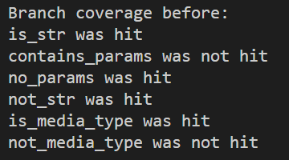


## Coverage improvement

### Individual tests

### Medon Abraham
**Function 1:** *def ack(self) -> None:*

*Old Covergae Results*

The initial covergae of the function is **50%**


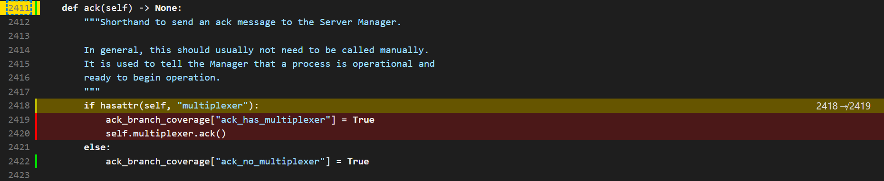

*Added Test*

The test_myclass_ack_method function is designed to test the ack method and to ensure that both branches of the ack method are covered during testing.

To test for *ack_has_multiplexer*:
+ The app.multiplexer attribute is set to a mock object Mock(), simulating an environment where the multiplexer attribute exists.
+ The ack method is called on the app instance, which should trigger the branch where multiplexer is present. The test asserts that the ack method on the multiplexer mock object was called exactly once, verifying that this branch was executed.

To test for *ack_no_multiplexer*:
+ The multiplexer attribute is deleted from the app instance using del app.multiplexer, simulating an environment where the multiplexer attribute does not exist.
+ The ack method is called again on the app instance, which should trigger the branch where multiplexer is absent.
  
```
def test_myclass_ack_method(app: Sanic):
   
    print("\nBranch coverage before: ")
    Sanic.print_ack_coverage()
    print("\n")

    app.multiplexer = Mock()
    app.ack()
   
    app.multiplexer.ack.assert_called_once()
    app.multiplexer.reset_mock()

    del app.multiplexer 
    app.ack()

    print("\nBranch coverage after: ")
    Sanic.print_ack_coverage()
    print("\n")

    with pytest.raises(AttributeError):
        app.multiplexer.ack.assert_not_called()

```


*New Coverage*

After running the tests, the function calls Sanic.print_ack_coverage() again to print the updated branch coverage, showing that all branches were hit during the test execution.


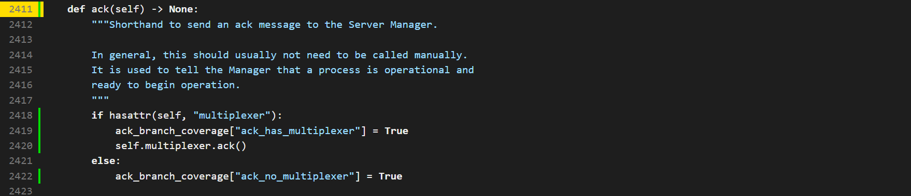

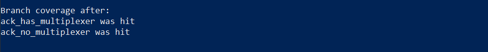


Coverage Improvement : *50%*


**Function 2:** *def _poll_monitor(self) -> Optional[MonitorCycle]*

*Old Covergae Results*

The initial covergae of the function is **55%**


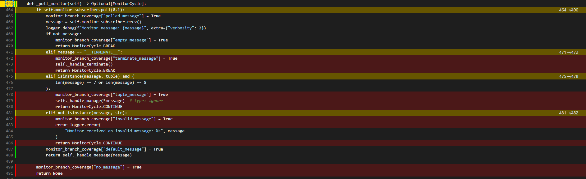


*Added Test*

These test cases are designed to thoroughly test the _poll_monitor method of the WorkerManager class, ensuring that all possible branches and code paths are executed. 
+ test_init_monitor_coverage: This test prints the branch coverage before any tests are run, providing a baseline for the initial state.
+ test_poll_monitor_no_message: Simulates a scenario where the monitor_subscriber does not receive any message (poll returns False).  
+ test_poll_monitor_empty_message: Simulates receiving an empty message (recv returns an empty string). Asserts that the result is MonitorCycle.BREAK.
+ test_poll_monitor_terminate_message: Simulates receiving the termination message (recv returns "__TERMINATE__"). Asserts that the _handle_terminate method is called and the result is MonitorCycle.BREAK.
+ test_poll_monitor_valid_tuple_message: Simulates receiving a valid tuple message with 7 elements (recv returns a tuple of 7 elements). Asserts that the _handle_manage method is called with the correct arguments and the result is MonitorCycle.CONTINUE.
+ test_poll_monitor_invalid_message_type: Simulates receiving a message of an invalid type (not a string) (recv returns an integer).Asserts that the result is MonitorCycle.CONTINUE.
+ test_poll_monitor_handle_message: Simulates receiving a valid string message (recv returns "Valid_Message"). Asserts that the _handle_message method is called with the correct argument and that the result is not None


```
@pytest.fixture
def worker_manager():
    p1 = Mock()
    p1.pid = 1234
    context = Mock()
    context.Process.return_value = p1
    pub = Mock()
    sub = Mock()
    manager = WorkerManager(1, fake_serve, {}, context, (pub, sub), {})
    manager._handle_terminate = Mock()
    manager._handle_manage = Mock()
    manager._handle_message = Mock()
    return manager

def test_init_monitor_coverage(worker_manager):
    print("\nBranch coverage before: ")
    worker_manager.print_monitor_coverage()
    print("\n")

def test_poll_monitor_no_message(worker_manager):
    worker_manager.monitor_subscriber.poll.return_value = False 
    result = worker_manager._poll_monitor()
    assert result is None 

def test_poll_monitor_empty_message(worker_manager):
    worker_manager.monitor_subscriber.poll.return_value = True 
    worker_manager.monitor_subscriber.recv.return_value = "" 
    result = worker_manager._poll_monitor()
    assert result ==  MonitorCycle.BREAK  


def test_poll_monitor_terminate_message(worker_manager):
    worker_manager.monitor_subscriber.poll.return_value = True
    worker_manager.monitor_subscriber.recv.return_value = "__TERMINATE__" 
    result = worker_manager._poll_monitor()
    worker_manager._handle_terminate.assert_called_once()
    assert result == MonitorCycle.BREAK


def test_poll_monitor_valid_tuple_message(worker_manager):
    worker_manager.monitor_subscriber.poll.return_value = True
    worker_manager.monitor_subscriber.recv.return_value = (1, 2, 3, 4, 5, 6, 7) 
    result = worker_manager._poll_monitor()
    worker_manager._handle_manage.assert_called_once_with(1, 2, 3, 4, 5, 6, 7)
    assert result == MonitorCycle.CONTINUE


def test_poll_monitor_invalid_message_type(worker_manager):
    worker_manager.monitor_subscriber.poll.return_value = True
    worker_manager.monitor_subscriber.recv.return_value = 12345 
    result = worker_manager._poll_monitor()
    assert result == MonitorCycle.CONTINUE


def test_poll_monitor_handle_message(worker_manager):
    worker_manager.monitor_subscriber.poll.return_value = True
    worker_manager.monitor_subscriber.recv.return_value = "Valid_Message" 
    result = worker_manager._poll_monitor()
    worker_manager._handle_message.assert_called_once_with("Valid_Message")
    assert result is not None 


def test_post_monitor_coverage(worker_manager):
    print("\nBranch coverage after: ")
    worker_manager.print_monitor_coverage()
    print("\n")

```

*New Coverage*


After running the tests, the function test_post_monitor_coverage prints the updated branch coverage, showing that all branches were hit during the test execution.


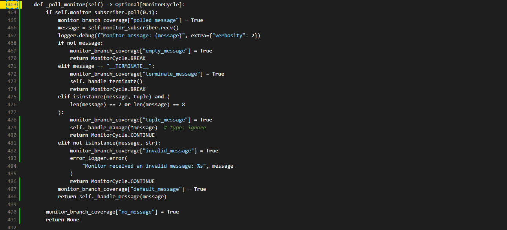

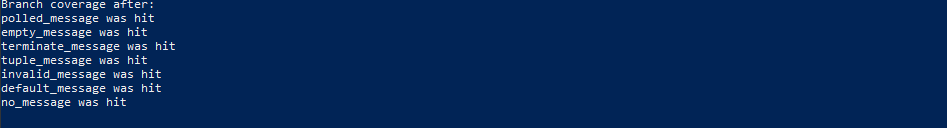


Coverage Improvement : *55%*


### Jana Salah Mohammad Ali Abuasbeh
**Function 1:** *def unregister_app(cls, app: Sanic) -> None:*

*Old Coverage Results*

The initial coverage of the function is **67%**:

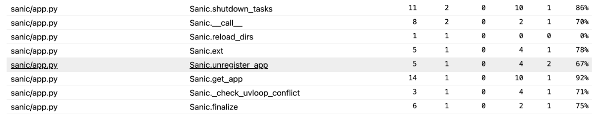

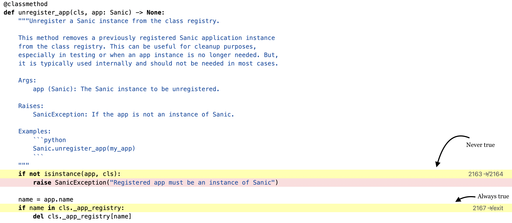


*Added Tests*

The tests test_unregister_non_sanic_instance(), test_successful_unregister_sanic_app(), and test_unsuccessful_unregister_non_registered_sanic_app() are designed to test the unregister_app() method and to ensure that both branches of the ack method are covered during testing.

To test for *not_an_instance*:
+ The test_unregister_non_sanic_instance() test improves branch coverage by attempting to unregister a non-sanic instance.
+ It triggers the 'not_an_instance' branch in the unregister_app function, ensuring that a SanicException is raised when a non-Sanic instance is passed. 

To test for *name_in_registry*:
+  The test_successful_unregister_sanic_app() test improves branch coverage by successfully unregistering a registered Sanic app. 
+ It triggers the 'name_in_registry' branch ensuring that a registered Sanic app can be successfully unregistered (such that its name is no longer in the registry). 

The test_unsuccessful_unregister_sanic_app() test improves branch coverage by attempting to unregister a non-registered Sanic app. This test does not hit any specific branch, but it ensures that the unregister_app function handles the case where the app to be unregistered is not in the registry without raising an exception.
 
```
def test_unregister_non_sanic_instance():
	# create non sanic object
	non_sanic = object()

	# try to unregister it, should raise SanicException
	with pytest.raises(SanicException) as exc_info:
    	Sanic.unregister_app(non_sanic)

	assert str(exc_info.value) == "Registered app must be an instance of Sanic"

def test_successful_unregister_sanic_app():
	# create new sanic app
	app = Sanic("TestApp")

	# manually register it if necessary
	Sanic._app_registry[app.name] = app

	Sanic.unregister_app(app)

	# check if the name is not in the registry anymore
	assert app.name not in Sanic._app_registry

def test_unsuccessful_unregister_non_registered_sanic_app():
	app = Sanic("UnregisteredApp")

	# make sure it's not registered
	if app.name in Sanic._app_registry:
    	del Sanic._app_registry[app.name]

	Sanic.unregister_app(app)

	assert app.name not in Sanic._app_registry

```

*New Coverage*

After running the tests, the function calls Sanic.print_unregister_coverage() again to print the updated branch coverage, demonstrating that all branches were hit during the test execution.

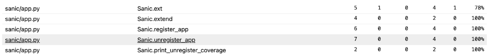

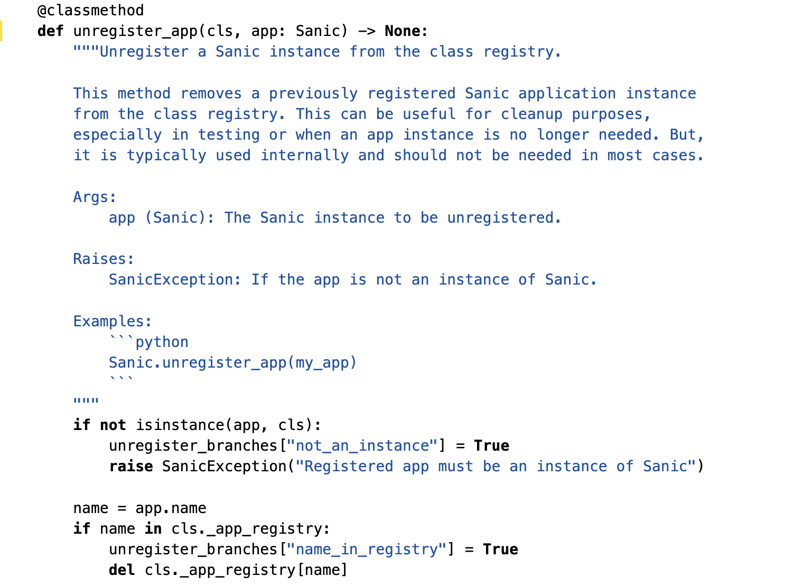

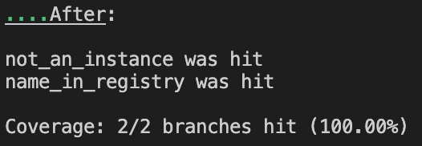


Coverage Improvement : *33%*

**Function 2:** *async def validate_file(request_headers: Header, last_modified: Union[datetime, float, int]) -> Optional[HTTPResponse]:*

*Old Coverage Results*

The initial coverage of the function is **75%**

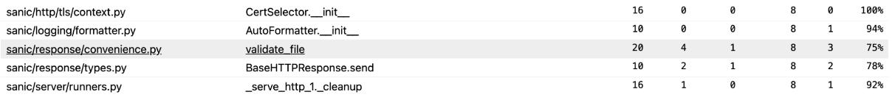

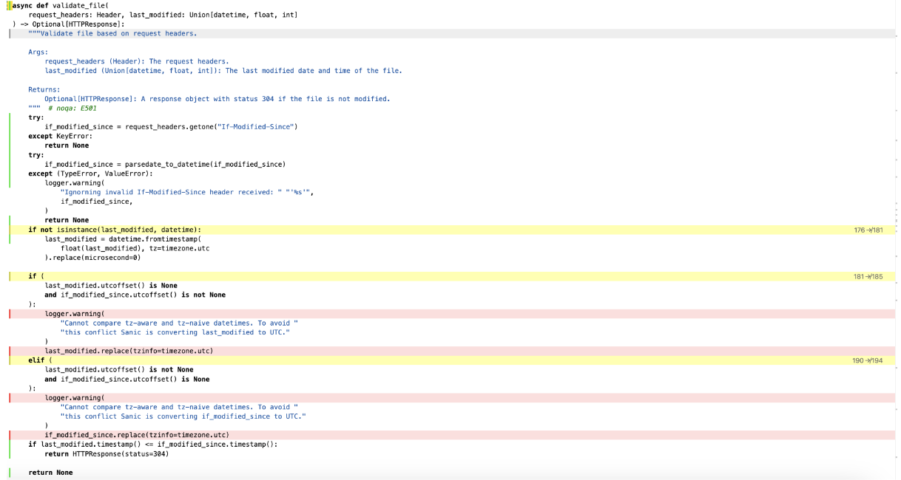


*Added Tests*

These test cases are designed to test the validate_file() method of the Sanic class, ensuring that all possible branches are covered.
+ test_timezone_none_last_modified(app): This test checks the scenario where the last_modified datetime object has no timezone information and the If-Modified-Since header has timezone information. It improves coverage by triggering the last_modified_none branch, ensuring that the function handles tz-aware and tz-naive datetime mismatches correctly by converting last_modified to UTC.
+ test_timezone_last_modified_with_none_if_modified_since(app):  This test checks the scenario where the last_modified datetime object is timezone-aware and the If-Modified-Since header is naive. It improves coverage by triggering the if_modified_since_none branch, similarly to the previous test function but by converting if_modified_since to UTC.

```
def test_initial_print_validate_coverage(app, capfd):
	print("Before: \n")
	convenience.print_validate_coverage(app)
	print("\n")

	captured = capfd.readouterr()
	print(captured.out)

def test_timezone_none_last_modified(app):
	@app.route("/")
	async def test_route(request: Request):
    	# Timezone is None datetime
    	last_modified = datetime.now().replace(tzinfo=None)
    	# Timezone datetime object
    	if_modified_since = datetime.utcnow().replace(tzinfo=timezone.utc)
    	request.headers['If-Modified-Since'] = if_modified_since.strftime("%a, %d %b %Y %H:%M:%S GMT")
    	return await validate_file(request.headers, last_modified)

	request, response = app.test_client.get("/")
	assert response.status == 304 or response.status is None or response.status == 500

def test_timezone_last_modified_with_none_if_modified_since(app):
	@app.route("/")
	async def test_route(request: Request):
    	last_modified = datetime.utcnow().replace(tzinfo=timezone.utc)
    	if_modified_since = datetime.now().replace(tzinfo=None)
    	# Formatting if_modified_since without timezone info
    	request.headers['If-Modified-Since'] = if_modified_since.strftime("%a, %d %b %Y %H:%M:%S")
    	return await validate_file(request.headers, last_modified)

	request, response = app.test_client.get("/")
	assert response.status == 304 or response.status is None or response.status == 500

def test_final_print_validate_coverage(app):
	print("After: \n")
	convenience.print_validate_coverage(app)
	print("\n")

```

*New Coverage*

After running the tests, the function test_final_print_validate_coverage prints the updated branch coverage, showing that all branches were hit during the test execution.

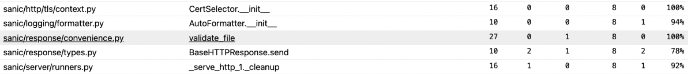
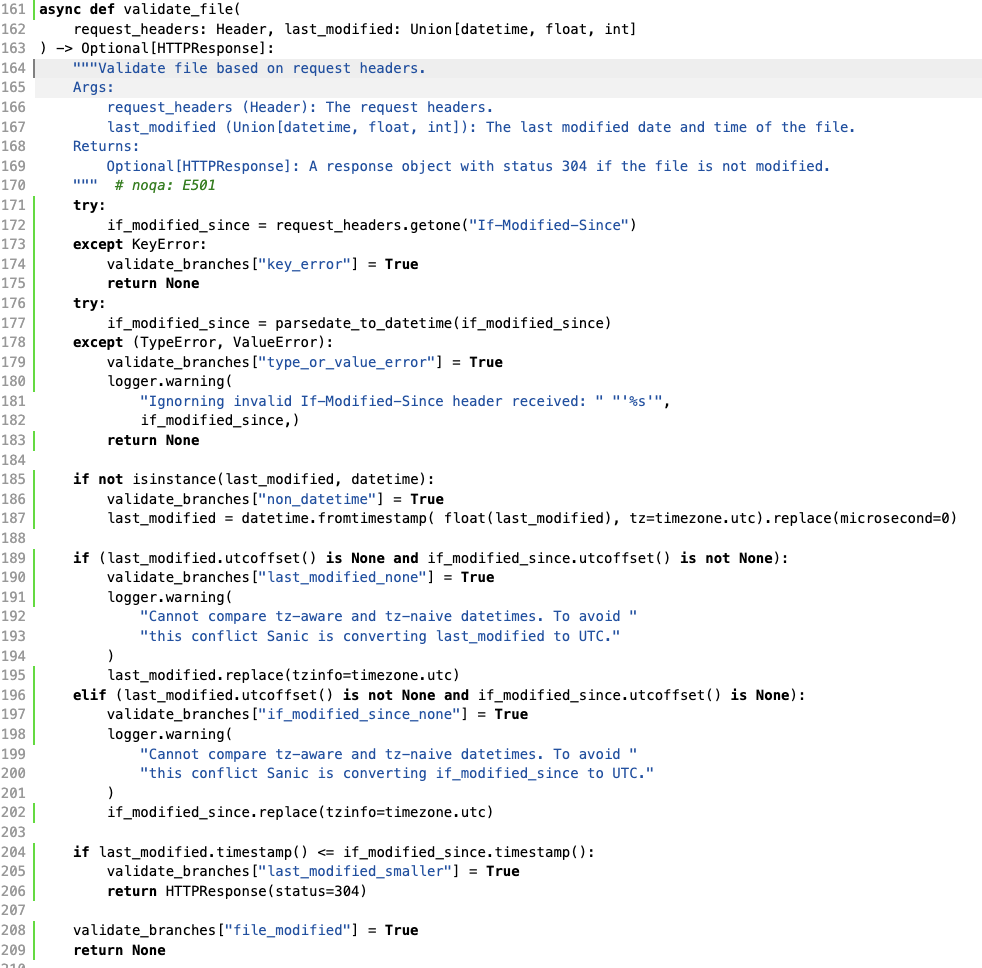
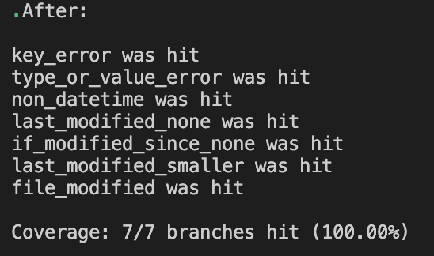

Coverage Improvement : *25%*


### Amirreza Darabi
**Function 1:** *def refresh(self,passthru: Optional[Dict[str, Any]] = None,) -> Sanic:*

*Old Covergae Results*

The initial covergae of the function is **71%**


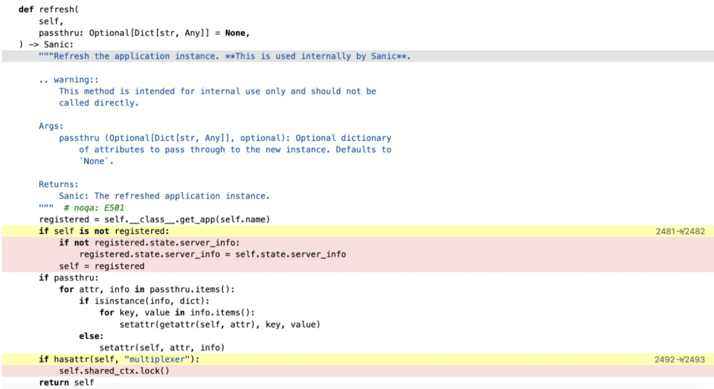

*Added Test*

The provided three tests ensure that the refresh method in the Sanic class correctly handles instance reassignment and updates:

test_refresh_when_self_not_registered
+ Verifies unregistered instance is replaced with the registered one.
+ Ensures the DEBUG configuration attribute is retained after refresh.
test_refresh_server_info_assignment
+ Checks server_info from a new instance is assigned to the registered instance.
+ Validates proper state updates during the refresh process.
test_refresh_with_multiplexer
+ Ensures multiplexer attribute is retained in the refreshed instance.
+ Confirms multiplexer's lock method is called during refresh.
  
```
def test_initial_refresh_print():
    print("\n Before:")
    Sanic.print_refresh_coverage()
    
def test_refresh_when_self_not_registered():
    # Register an instance with a different name
    registered_instance = Sanic("test_instance")
    Sanic._app_registry["test_instance"] = registered_instance

    new_instance = Sanic("another_instance")
    new_instance.config.DEBUG = True
    new_instance.name = "test_instance"

    refreshed_instance = new_instance.refresh()

    # Assertions
    assert refreshed_instance is registered_instance  # Ensure it's now the registered instance
    assert refreshed_instance.config.DEBUG is True  # Check the attribute was copied

def test_refresh_server_info_assignment():
    registered_instance = Sanic("test_instance")
    Sanic._app_registry["test_instance"] = registered_instance

    # Create a new instance with a different name
    new_instance = Sanic("another_instance")
    new_instance.state.server_info = {"info": "example"}

    new_instance.name = "test_instance"

    refreshed_instance = new_instance.refresh()

    # Assertions
    assert refreshed_instance is registered_instance
    assert refreshed_instance.state.server_info == {"info": "example"}

def test_refresh_with_multiplexer():
    # Create an instance with multiplexer attribute
    app = Sanic("test_app")
    app.multiplexer = Mock()

    refreshed_instance = app.refresh()

    # Assertions
    assert hasattr(refreshed_instance, "multiplexer")
    refreshed_instance.multiplexer.lock.assert_called_once()

def test_final_refresh_print():
    print("\n After:")
    Sanic.print_refresh_coverage()


def test_initial_purge_print():
    print("\n Before:")
    Sanic.print_purge_coverage()

```


*New Coverage*

After running the tests, the function calls Sanic.print_refresh_coverage() again to print the updated branch coverage, showing that all branches were hit during the test execution.


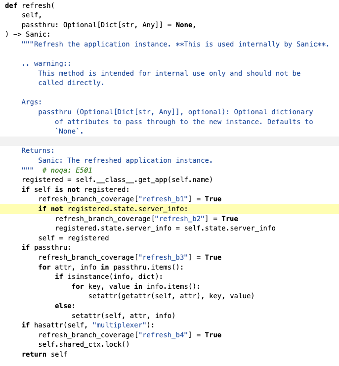

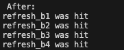


Coverage Improvement : *21%*


**Function 2:** *def _poll_monitor(self) -> Optional[MonitorCycle]*

*Old Covergae Results*

The initial covergae of the function is **55%**


*Added Test*

These test cases are designed to thoroughly test the _poll_monitor method of the WorkerManager class, ensuring that all possible branches and code paths are executed. 
+ test_init_monitor_coverage: This test prints the branch coverage before any tests are run, providing a baseline for the initial state.
+ test_poll_monitor_no_message: Simulates a scenario where the monitor_subscriber does not receive any message (poll returns False).  
+ test_poll_monitor_empty_message: Simulates receiving an empty message (recv returns an empty string). Asserts that the result is MonitorCycle.BREAK.
+ test_poll_monitor_terminate_message: Simulates receiving the termination message (recv returns "__TERMINATE__"). Asserts that the _handle_terminate method is called and the result is MonitorCycle.BREAK.
+ test_poll_monitor_valid_tuple_message: Simulates receiving a valid tuple message with 7 elements (recv returns a tuple of 7 elements). Asserts that the _handle_manage method is called with the correct arguments and the result is MonitorCycle.CONTINUE.
+ test_poll_monitor_invalid_message_type: Simulates receiving a message of an invalid type (not a string) (recv returns an integer).Asserts that the result is MonitorCycle.CONTINUE.
+ test_poll_monitor_handle_message: Simulates receiving a valid string message (recv returns "Valid_Message"). Asserts that the _handle_message method is called with the correct argument and that the result is not None


```
@pytest.fixture
def worker_manager():
    p1 = Mock()
    p1.pid = 1234
    context = Mock()
    context.Process.return_value = p1
    pub = Mock()
    sub = Mock()
    manager = WorkerManager(1, fake_serve, {}, context, (pub, sub), {})
    manager._handle_terminate = Mock()
    manager._handle_manage = Mock()
    manager._handle_message = Mock()
    return manager

def test_init_monitor_coverage(worker_manager):
    print("\nBranch coverage before: ")
    worker_manager.print_monitor_coverage()
    print("\n")

def test_poll_monitor_no_message(worker_manager):
    worker_manager.monitor_subscriber.poll.return_value = False 
    result = worker_manager._poll_monitor()
    assert result is None 

def test_poll_monitor_empty_message(worker_manager):
    worker_manager.monitor_subscriber.poll.return_value = True 
    worker_manager.monitor_subscriber.recv.return_value = "" 
    result = worker_manager._poll_monitor()
    assert result ==  MonitorCycle.BREAK  


def test_poll_monitor_terminate_message(worker_manager):
    worker_manager.monitor_subscriber.poll.return_value = True
    worker_manager.monitor_subscriber.recv.return_value = "__TERMINATE__" 
    result = worker_manager._poll_monitor()
    worker_manager._handle_terminate.assert_called_once()
    assert result == MonitorCycle.BREAK


def test_poll_monitor_valid_tuple_message(worker_manager):
    worker_manager.monitor_subscriber.poll.return_value = True
    worker_manager.monitor_subscriber.recv.return_value = (1, 2, 3, 4, 5, 6, 7) 
    result = worker_manager._poll_monitor()
    worker_manager._handle_manage.assert_called_once_with(1, 2, 3, 4, 5, 6, 7)
    assert result == MonitorCycle.CONTINUE


def test_poll_monitor_invalid_message_type(worker_manager):
    worker_manager.monitor_subscriber.poll.return_value = True
    worker_manager.monitor_subscriber.recv.return_value = 12345 
    result = worker_manager._poll_monitor()
    assert result == MonitorCycle.CONTINUE


def test_poll_monitor_handle_message(worker_manager):
    worker_manager.monitor_subscriber.poll.return_value = True
    worker_manager.monitor_subscriber.recv.return_value = "Valid_Message" 
    result = worker_manager._poll_monitor()
    worker_manager._handle_message.assert_called_once_with("Valid_Message")
    assert result is not None 


def test_post_monitor_coverage(worker_manager):
    print("\nBranch coverage after: ")
    worker_manager.print_monitor_coverage()
    print("\n")

```

*New Coverage*


After running the tests, the function test_post_monitor_coverage prints the updated branch coverage, showing that all branches were hit during the test execution.


Coverage Improvement : *55%*


